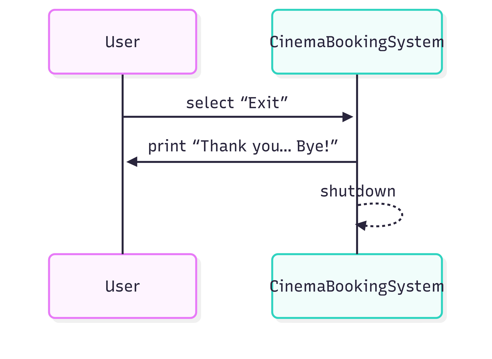

# Cinemas Booking System

## 1. 📌 Project Desc

A command-line ticket-booking prototype for cinemas. 

## 2. 💡 Assumptions & Design Rationale

- **Seat indexing**: rows 0–25 map to A–Z, columns 0–49 map to seats 1–50.  
- **Allocation strategy**: default is “furthest row, then center-most contiguous block.” Custom starts overflow naturally.  
  
## 3. 🔧 Environment Setup

```
- Python 3.9 (macOS or Linux)  
- pyetst  (for unit testing)
```

When installing pytest, it will automatically bring in some necessary helper libraries, which are already listed in requirements.txt.

<details>
<summary>📦 Click to see <strong>requirements.txt</strong> dependency list</summary>

```
exceptiongroup==1.3.0  
iniconfig==2.1.0  
packaging==25.0  
pluggy==1.6.0  
Pygments==2.19.2  
pytest==8.4.1  
tomli==2.2.1  
typing_extensions==4.14.0  
```

</details>

## 4. ⚙️ Installation

```bash
# Prerequisites: Set up Python environment (using conda)

# Navigate to the project root
cd G-Cinema-Booking-System

# (Optional) Create and Activate Virtual Environment with Python 3.9 and pip & Install Dependencies
conda create -n g2env python=3.9 pip
conda activate g2env

# Install dependencies including pytest and necessary pytest helper libraries
pip install -r requirements.txt
```

## 5. 🚀 Usage

```bash
# Navigate to the project root
cd python-project
```

```bash
# Run tests
pytest

# Launch the application
PYTHONPATH=.:src python3 -m src
```

Then input as prompted, for example:

```
Please define movie title and seating map in [Title] [Row] [SeatsPerRow] format:
> Inception 8 10
```


## 6. 🗂 Project Structure

The repository is organized into clear layers to separate source code, documentation, logs, and tests.

| Path | Purpose |
|---|---|
| `README.md` | High-level overview, quick start, design class and sequence diagrams |
| `pytest.ini` | pytest.ini is a unified config center for pytest |
| `.gitignore` | - |
| `requirements.txt` | - |
| **docs** | - | 
| `docs/design.md` | Detailed design documentation with diagrams and rationale  |
| **log** | - | 
| `logs/booking.log` | Runtime logs capturing booking operations |
| **src** | - | 
| `src/__main__.py` | entry point; runs `PYTHONPATH=.:src python3 -m src` |
| `src/config.py` | global configuration: logging defaults  |
| `src/cinema/seatmap.py` | `SeatMap` class: seat matrix, rendering, allocation algorithms |
| `src/cinema/booking.py` | `Booking` **entity**: holds booking ID and seat list  |
| `src/cinema/manager.py` | `BookingManager` class: ID generation and booking registry  |
| `src/cinema/system.py` | `CinemaBookingSystem` CLI controller: user interaction flows  |
| **test** | - | 
| `tests/conftest.py` | **Pytest fixtures and shared configuration** |
| `tests/test_seatmap.py` | Unit tests for seat allocation algorithms |
| `tests/test_manager.py` | Tests for booking ID generation |
| `tests/test_system.py` | Integration tests for workflows CLI |

---

## 7. 🧪 Tests 

**We use pytest for TDD:**

**Pytest** framework with fixtures in `conftest.py`.   
**Coverage** of boundary conditions (full seats, overflow, invalid inputs). 

 - test_seatmap.py covers default/custom allocation edge cases.
 - test_manager.py validates ID generation.
 - test_system.py does a simple CLI sanity check.


## 8. 📝 Detailed Design

Refer to [docs/README.md](docs/README.md) for full class and sequence diagrams, module responsibilities, configuration, and testing strategy. 


### 8.1 Detailed Design

Contains the following sections:

**Module Responsibilities**

| Module | Responsibility |
|---|---|
| **SeatMap** | Manages 2D seat matrix, renders UI, **default and custom allocation**, free count query |
| **Booking** | Domain **entity** storing **booking ID** and **seat list** |
| **BookingManager** | Generates **unique IDs**, stores and retrieves `Booking` **instances** |
| **CinemaBookingSystem** | Command-line interface, input, menus, flows |

### 8.2  Class Diagram

<div align="center">
  
</div>

### 8.3 Sequence Diagram (Main)

- **Application Start** Sequence Diagram   
- **Booking Tickets** Sequence Diagram   
- **Check Bookings** Sequence Diagram   
- **Exit** Sequence Diagram  

“**Application Start**” Sequence Diagram

<div align="center">
  
</div>

“**Booking Tickets**” Sequence Diagram

<div align="center">
  
</div>

“**Check Bookings**” Sequence Diagram

<div align="center">
  
</div>

“**Exit**” Sequence Diagram  

<div align="center">
  
</div>
