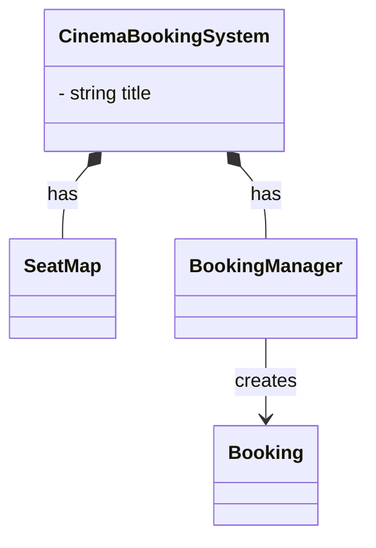
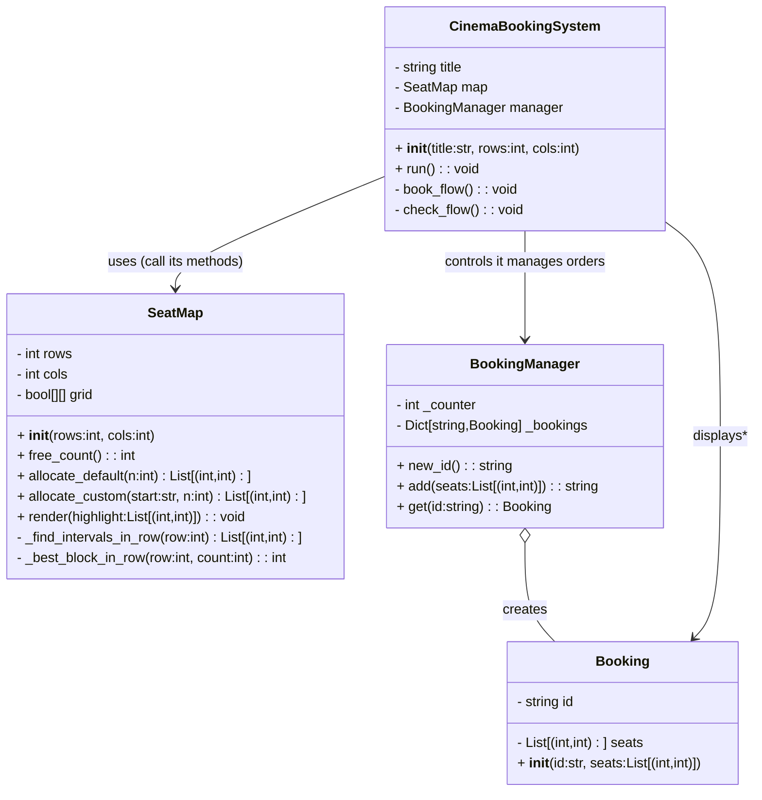
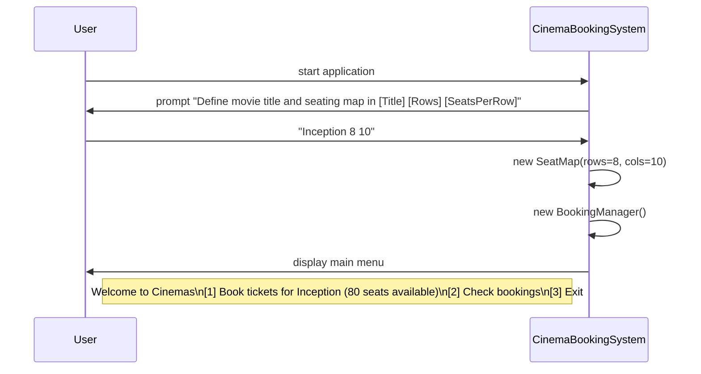
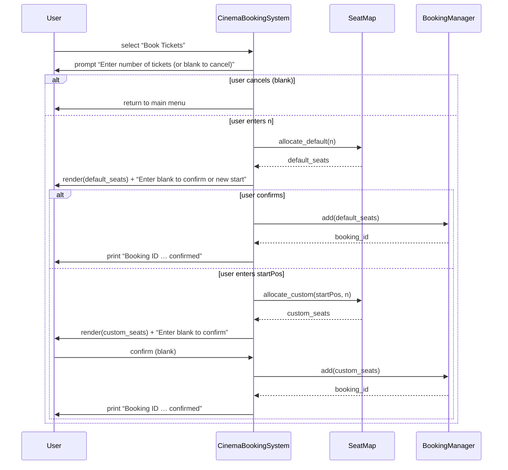
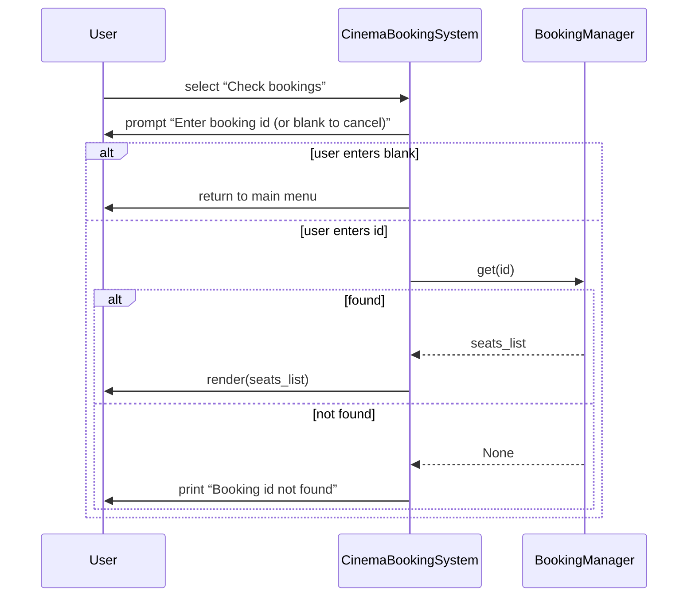
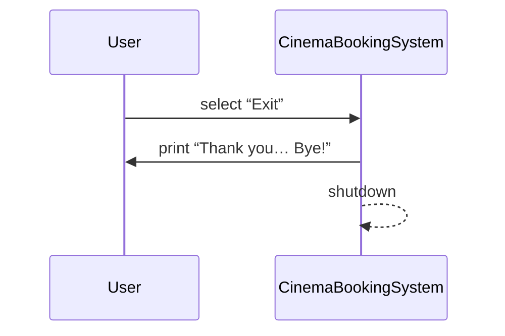

# Cinemas Booking System

## 1. 📝 Detailed Design 

Contains the following sections:

**Module Responsibilities**

| Module | Responsibility |
|---|---|
| **SeatMap** | Manages 2D seat matrix, renders UI, **default and custom allocation**, free count query |
| **Booking** | Domain **entity** storing **booking ID** and **seat list** |
| **BookingManager** | Generates **unique IDs**, stores and retrieves `Booking` **instances** |
| **CinemaBookingSystem** | Command-line interface, input, menus, flows |


## 2. Class Diagram



Detail Class Diagram



## 3. Sequence Diagram 

0. **Application Start** Sequence Diagram 
1. **Booking Tickets** Sequence Diagram 
2. **Check Bookings** Sequence Diagram 
3. **Exit** Sequence Diagram 

“0. **Application Start**” Sequence Diagram



“1. **Booking Tickets**” Sequence Diagram

```sql
User → CinemaBookingSystem → SeatMap → CinemaBookingSystem → BookingManager → User
```



“2. **Check Bookings**” Sequence Diagram



“3. **Exit**” Sequence Diagram



