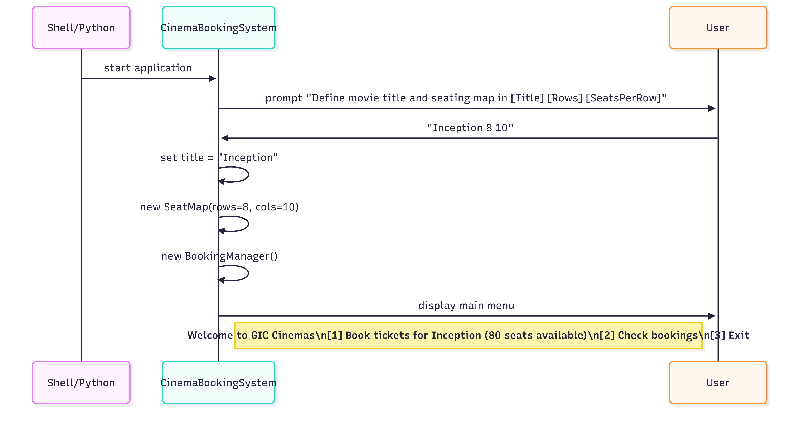
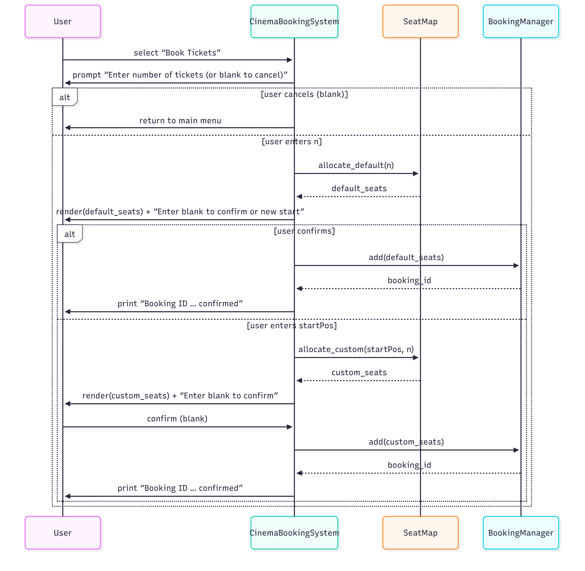
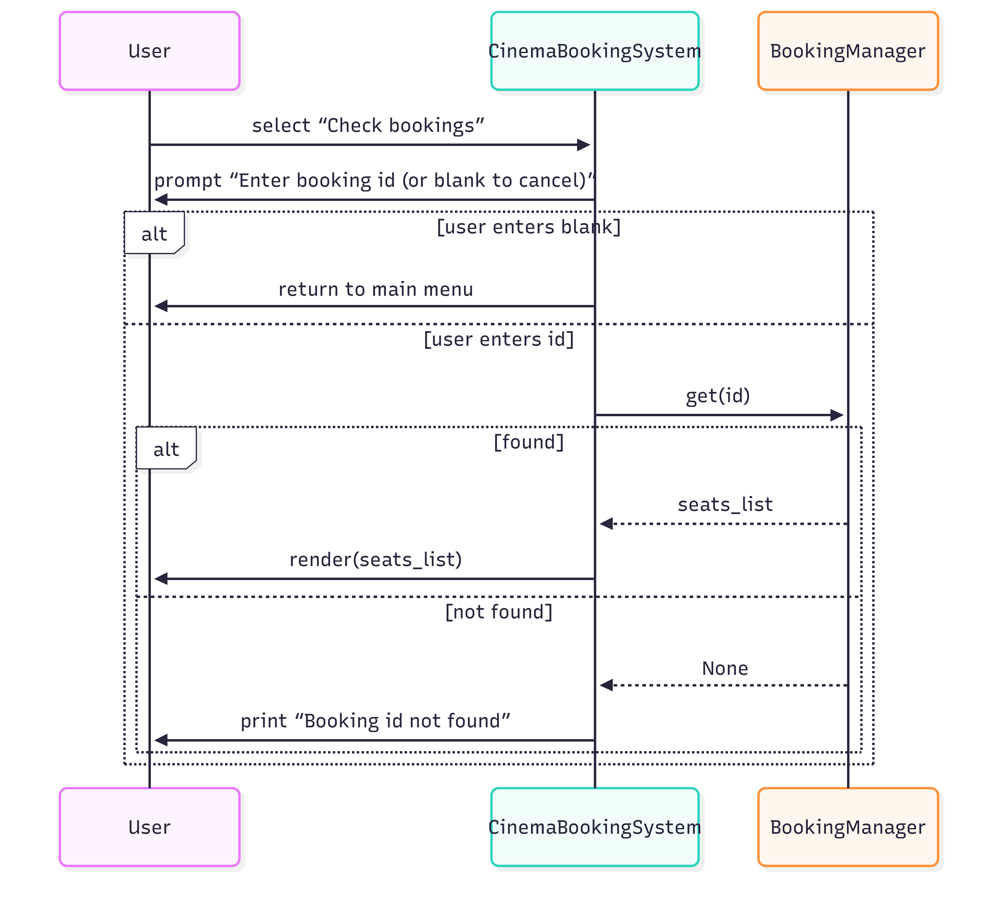

# Cinemas Booking System

## 1. 📝 Detailed Design 

Contains the following sections:

**Module Responsibilities**

| Module | Responsibility |
|---|---|
| **SeatMap** | Manages 2D seat matrix, renders UI, **default and custom allocation**, free count query |
| **Booking** | Domain **entity** storing **booking ID** and **seat list** |
| **BookingManager** | Generates **unique IDs**, stores and retrieves `Booking` **instances** |
| **CinemaBookingSystem** | Command-line interface, input, menus, flows |

## 2. Class Diagram

  

Detail Class Diagram

  

## 3. Sequence Diagram 

- **Application Start** Sequence Diagram    
- **Booking Tickets** Sequence Diagram    
- **Check Bookings** Sequence Diagram    
- **Exit** Sequence Diagram  

“**Application Start**” Sequence Diagram

  

“**Booking Tickets**” Sequence Diagram

  

“**Check Bookings**” Sequence Diagram

  

“**Exit**” Sequence Diagram  

  

